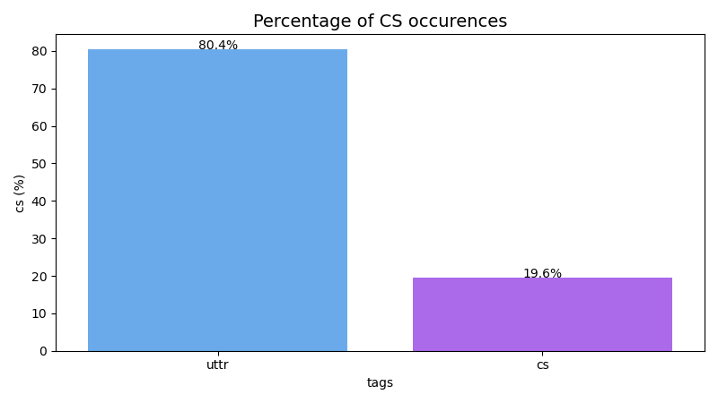
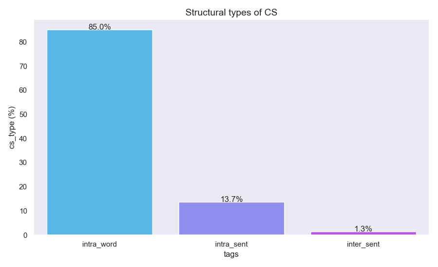
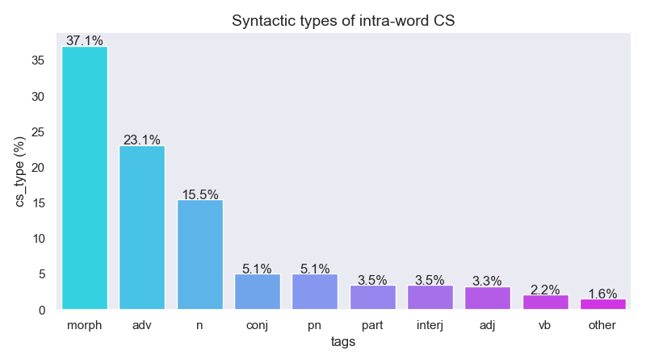
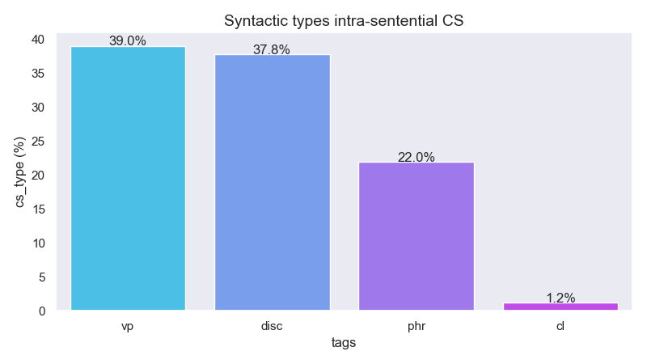
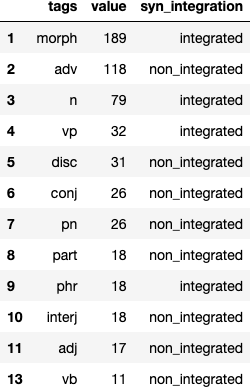
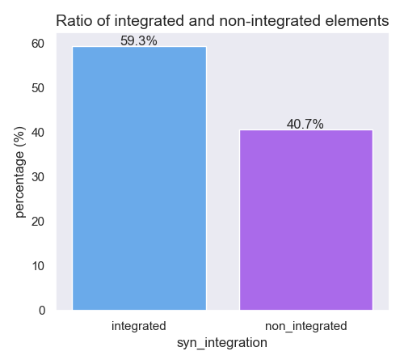

# Kazakh-Russian Code-Switching Analysis

by Moldir Baidildinova

## Introduction

Code-switching (CS) is the phenomenon where individuals use two or more languages within a single conversation or even within a single utterance. In Post-Soviet Union countries, code-switching to Russian is extremely common in daily communication since Russian has been the dominant language for a long time. Although countries have gained independence and promoted language policies with a strong emphasis on the local language, Russian is continued to be used in many aspects of social, cultural, and political life. And Kazakhstan is no exception where inter-sentential and intra-sentential types of code-switching are practiced; intra-word code-switching is also observed since a majority of Kazakhs are bilingual. Therefore, this term project aimed to carry out an explanatory analysis of Kazakh-Russian CS based on the conversational dataset and investigate structural and syntactic types of CS through **linguistic annotation**. The questions in focus are whether Kazakh-Russian bilingualism is balanced and whether the language shift is happening toward L2 Russian.

## Data Sourcing

The conversational dataset is sampled from the IARPA Babel Program Kazakh language collection release [IARPA-babel302b-v1.0a](https://catalog.ldc.upenn.edu/LDC2018S13). It contains approximately 203 hours of Kazakh conversational and scripted telephone speech collected in 2013 and 2014 along with corresponding transcripts. The Kazakh speech in this release represents that spoken in the Northeastern and Southern dialect regions of Kazakhstan. The gender distribution among speakers is approximately equal; speakers' ages range from 16 years to 64 years. 

## Data Annotation

First, [annotation scheme](https://github.com/Data-Science-for-Linguists-2023/Kazakh-Russian-Code-Switching-Analysis/blob/main/annotated-data-samples/annotation_scheme_final_draft.md) was developed based on [Dyachkov et al.(2020)](https://www.dialog-21.ru/media/5085/dyachkovvvplusetal-101.pdf) who annotated and analyzed CS in four corpora of minority languages of Russia. Next, [fifty (50) text files](https://github.com/Data-Science-for-Linguists-2023/Kazakh-Russian-Code-Switching-Analysis/blob/main/annotated-data-samples/export-2023-04-13T01_31_30.066Z.json) have been annotated using the [Labelbox platform](https://docs.labelbox.com/docs/overview). The Labelbox platform offers a standoff annotation (offline) format where annotations are stored separately from the annotated text which can be retrieved via the API key. For the project in focus, the annotation workflow looks like this:

I created a dataset and uploaded text files for annotation; then, created an ontology known as an annotation scheme; and finally, generated a project where text samples were annotated using the ontology. More detailed information on the Labelbox annotation workflow can be found [here](https://github.com/Data-Science-for-Linguists-2023/Kazakh-Russian-Code-Switching-Analysis/blob/main/progress_report.md). 

Finally, annotated files were uploaded to the [JNB](https://nbviewer.org/github/Data-Science-for-Linguists-2023/Kazakh-Russian-Code-Switching-Analysis/blob/main/notebooks/annotationAnalysis.ipynb#Load-Annotated-Files) and then [analyzed](https://nbviewer.org/github/Data-Science-for-Linguists-2023/Kazakh-Russian-Code-Switching-Analysis/blob/be7a7094bc6ef79c342b349b0674fc5f9cba458b/notebooks/annotationAnalysis.ipynb#Analysis-&-Vizualization) to address the project goals.

## Analysis

Overall, 3071 utterances were annotated and 601 occurrences of CS were observed. Consequently, only **19.6%** of annotated text contained CS fragments which implies that Kazakh-Russian bilingualism is not as balanced as was found in [four corpora of minority languages of Russia](https://www.dialog-21.ru/media/5085/dyachkovvvplusetal-101.pdf) by Dyachkov et al.(2020). 

    

It might be due to sociolinguistic factors such as Kazakh is the official state language of Kazakhstan unlike minority languages of Russia and counts about 12 million speakers worldwide (Yessenbayev, Kozhirbayev, & Makazhanov, 2020). Moreover, the Kazakhstan government reinforces a trilingual language policy (Kazakh-Russian-English) with a strong emphasis on the Kazakh language. These factors might have contributed to weakening the dominance of Russian reflected in imbalanced bilingualism. This trend is also observed in the structural types of CS, where word-internal shifts are significantly prevalent (85%) compared to intra- and inter-sentential CS. According to Dyachkov et al.(2020), the low rate of word-internal shifts is specific to balanced bilinguals, whereas the high rate of intra-word CS indicates dominance asymmetry toward the matrix language (Kazakh).  

    

On the other hand, the extremely low percentage of inter-sentential CS (1.3%) shows that language shift toward L2 Russian is in very early stage. In other words, the less progressed the language shift is, the less frequently clausal switches occur. The moderate frequency of intra-sentential CS (13.7%) also suggests that language shift is in early stage or on the way of forming. Interesting trend emerges from the individual analysis of structural types of CS. Namely, within the word-internal shifts the most common syntactic constituent is morphemes (37.1%)- Russian stems followed by Kazakh affixes. 

    

Russian stems are highly integrated into the clause structure so they behave like Kazakh constituents. For example, Russian nouns *продавец-seller* and *настроение-mood* are marked with Kazakh case endings and possessive suffixes and syntactically integrated into the sentence:

- Example 1:

	> **продавец**+ке           бар         шығар  орын
	>
	> **seller.Rus**+DAT.Kaz   [there is]   might  position
	>
	> *There is might be a position for a seller.*

- Example 2:

	> апайдың       **настроение**+сі+не           байланысты  дейсің ғой
	>
	> teacher.GEN   **mood.Rus**+poss.Kaz+DAT.Kaz   depend     say    well
	>
	> *Well, it depends on teacher's mood.* 

On the contrary, single-word insertions are not syntactically integrated and can be readily replaced by Kazakh equivalents. It should be noted that for the project in focus, Russian loan words were excluded, and only words that have alternatives in Kazakh were annotated. Interestingly, speakers tend to use both Russian and Kazakh variations of the word in one utterance. For instance:

- Example 3:

	> **поняла**          ұқтың            ба
	>
	> **understand.Rus**  understand.Kaz   part.Kaz
	>
	> *Do (you) understand?*

- Example 4:

	> барамыз   ғой   тағы      **ещё**
	>
	> come.Fut  well  again.Kaz  **again.Rus**
	> 
	> *Well, we will come again.* 

- Example 5:

	> **может**     мартта мүмкін    тағы  келерміз біздер
	> 
	> **maybe.Rus** March  maybe.Kaz again come.Fut we
	>
	> *Maybe we will come again in March.*

- Example 6:

	> **хорошо хорошо** жарайды жарайды
	> 
	> *fine.Rus*.       fine.Kaz
	>
	> *Fine.*

Why speakers of Kazakh go back and forth between two languages in intra-word CS and how this phenomenon is related to imbalanced bilingualism requires further in-depth investigation. 

    

Among intra-sentential CS verbal phrases and other types of phrases (NP, AdvP, AdjP) are also morphosyntactically embedded into the Kazakh sentence as shown below:

- Example 7:

	> Қуаныш         ағаңды    **поздравить**       еттің      бе    подполковник        алды    ғой
	>
	> Kuansysh.name  uncle.ACC **congratulate.Rus** modal.verb parț. lieutenant colonel received part.   
	>
	> *Have you congratulated uncle Kuansysh with receiving the rank of lieutenant colonel.*

- Example 8:

	> көп телефонмен **болтать**   етуге      болмайды
	>
	> long phone.INST **chat.Rus** modal.verb do not
	> 
	> *Avoid prolonged conversations on the phone.*

- Example 9:

	> **звон**+дап             жатырсың
	>
	> **call.Rus**+Kaz.suffix  modal.verb.2PS
	>
	> *(You) are calling.*

The main Russian verbs *поздравить-congratulate, болтать-to chat* is followed by Kazakh modal verbs and form the predicative phrase of the clause while the Russian stem *звон-call* is marked with Kazakh verb inflections (-дап) and followed by the modal verb (жатырсың). Following Dyachkov et al.(2020) experiment, I calculated the overall ratio of integrated and non-integrated elements by collapsing the structural types of CS and considering individual elements as integrated or non-integrated depending on their morphosyntactic role in the sentence. For example, elements marked with Kazakh affixes and/or followed by modalities are deemed as integrated, while single-word Russian insertions are deemed as non-integrated, as shown in the table below.  

    

According to Dyachkov et al.(2020), the use of interconnected language elements is commonly seen during a language shift, whereas separate language elements are typical of a situation where balanced bilingualism is maintained. Overall, the ratio of integrated and non-integrated elements show mixed trend since the difference is not as significant as was observed in four corpora of minority languages of Russia. 

    

Another fact that accounts for imbalanced bilingualism is that some noun phrases do not match in gender as in Russian a preceding adjective should align in gender with a proceding noun. For instance, the speakers frequently use the following mismatched adjectives and nouns: *высш**ий** (masculine) образование(neuter) юридическ**ий** (masculine), военн**ый** (masculine) кафедра* (feminine). Morphologically correct forms are: высш**eе** образование юридическ**oе** - all elements are marked with neutral endings, военн**ая** кафедра - both elements are marked with feminine endings. 

## Limitations

Despite convincing preliminary results, there are several limitations that should be addressed. First, I annotated and reviewed the dataset, meaning an annotator bias might have taken place during this solo project.  To ensure the quality and address language-specific nuances accordingly would be better to have an annotation team  (at least two annotators to attest to inter-annotator agreement). Second, all annotation has been done manually, limiting the project's efficiency. For future replication of the project, an automated or semi-automated annotation process is preferred. Third, the sample size is very limited since only 50 conversations were annotated, which, in turn, might lead to partial rather than complete results.  Last but not least, the lack of information regarding the educational background of speakers might have also affected my observations. Namely, I do not know if the speakers are simultaneous or sequential bilinguals and whether they studied in Kazakh or Russian schools. Having a mix of subjects from both groups(simultaneous/ sequential bilinguals)/schools (Kazakh/Russian) might have led to different results.   

## Conclusion

In conclusion, despite the above-mentioned limitations, the analysis of the data shows that code-switching to Russian is present in a significant portion of the annotated utterances, with the most common type being intra-word code-switching. This type of code-switching mainly consists of Russian morphemes, adverbs, and nouns integrated into the Kazakh language. Intra-sentential code-switching is the second most common type, with verbal phrases and discourse markers being the most frequent linguistic elements used. It is worth noting that most of the code-switching instances are syntactically integrated into the Kazakh language. These findings shed light on the nature of code-switching in the Kazakh-Russian bilingual context and contribute to a better understanding of the linguistic dynamics of this community.

## Process Reflection

It was very interesting, at the same time, challenging to carry out this project. First of all, at the beginning of the project, I struggled to find the 'right' dataset that addresses the project goals due to the scarcity of documented data for the Kazakh language compared to English or other well-known languages. I went back and forth between the [Kazakh Speech Corpus](https://issai.nu.edu.kz/kz-speech-corpus/) and the current Babel language pack. The former was solely designed for Kazakh ASR purposes; therefore, samples were manually selected by the researchers from books, news outlets, etc. ensuring the high quality of utterances. Moreover, the authors cleaned out the Russian sentences or purely Russian words. So, there was no clear evidence of Kazakh-Russian code-switching within the conversation or sentence. Thus, I switched to the Babel language pack that reflected the spontaneous conversation and therefore contained great examples of Kazak-Russian code-switching instances. More detailed information on dataset comparisons can be found [here](https://github.com/Data-Science-for-Linguists-2023/Kazakh-Russian-Code-Switching-Analysis/blob/main/notebooks/datasetsComparison.ipynb)

Next, finding an efficient annotation tool also took a while. First, I tried the LightTag platform, then the OxygenXML application but these trials were unsuccessful as was documented on a progress report. LightTag was not suitable for the long text files while OxygenXML required considerable training to perform annotation. Finally, I chose the Labelbox platform which allowed me to annotate the samples more coherently. However, the next challenge I faced was parsing highly nested JSON files since the Labelbox platform renders output as nested dictionaries. Nevertheless, with the great help of course instructors, I was finally able to carry out an initial analysis of Kazakh-Russian CS and arrive at preliminary results as discussed above. 
 

## Abbreviations

Kaz - Kazakh, Rus - Russian, ACC — accusative, GEN — genitive, DAT - Dative, INST - instrumental, part — particle, 2PS —2nd person, poss. - possessive suffix, Fut - future suffix, modal.verb - modal verb. 

## References

Dyachkov, V. V., Khomchenkova, I. A., Pleshak, P. S., & Stoynova, N. M. (2020). Annotating and exploring code-switching in four corpora of minority languages of Russia. In Computational Linguistics and Intellectual Technologies (pp. 228-240).

Ide, & Pustejovsky, J. (2017). Handbook of Linguistic Annotation (Ide & J. Pustejovsky, Eds.; 1st ed.) Springer Netherlands. https://doi.org/10.1007/978-94-024-0881-2

Khassanov, Y., Mussakhojayeva, S., Mirzakhmetov, A., Adiyev, A., Nurpeiissov, M., & Varol, H. A. (2020). A crowdsourced open-source Kazakh speech corpus and initial speech recognition baseline. arXiv preprint arXiv:2009.10334.

Khomitsevich, O., Mendelev, V., Tomashenko, N., Rybin, S., Medennikov, I., Kudubayeva, S. (2015). A Bilingual Kazakh-Russian System for Automatic Speech Recognition and Synthesis. In: Ronzhin, A., Potapova, R., Fakotakis, N. (eds) Speech and Computer. SPECOM 2015. Lecture Notes in Computer Science(), vol 9319. Springer, Cham.

Peirce, Gina M. (2018) Representational and processing constraints on the acquisition of case and gender by heritage and L2 learners of Russian: a corpus study. Heritage Language Journal, 15 (1). pp. 95-115. ISSN 1550-7076

Yessenbayev, Z., Kozhirbayev, Z., & Makazhanov, A. (2020). KazNLP: A Pipeline for Automated Processing of Texts Written in Kazakh Language. Paper presented at the Speech and Computer - 22nd International Conference, SPECOM 2020, Proceedings, Russian Federation.

