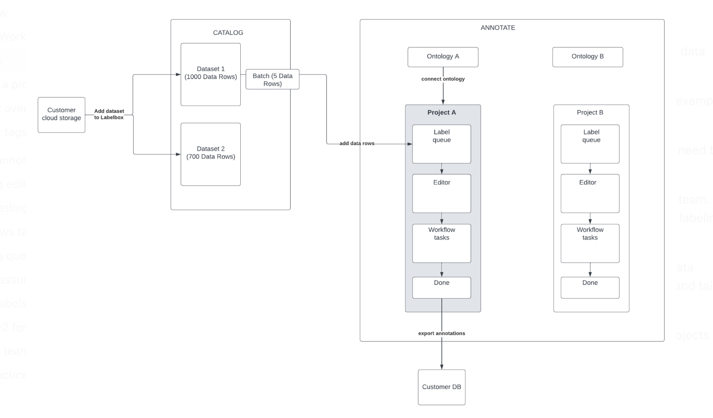

# 3rd Progress Report

4/9/2023

## Summary

The third progress report is focused on annotating the text samples and updating the annotation scheme. As for now, 40 text samples were annotated, and they can be found [here]() in a JSON format. Initially, I planned to annotate 50 samples. I hope to achieve this milestone for the next presentation part of the project. Annotating and reviewing text files take considerable time; therefore,  I haven't started the data analysis part yet. The goal is to finalize the analysis before the presentation date. Previous preliminary analysis can be found [here](https://github.com/Data-Science-for-Linguists-2023/Kazakh-Russian-Code-Switching-Analysis/blob/main/notebooks/annotatedDataset.ipynb).

Also, the [annotation scheme]() was updated to incorporate recent observations. For example, for intra-word tagging, verbs (vb), particles (part), and other subtags were added since text samples contain many instances of these linguistic units. 

Finally, a stand-alone Markdown file was created as a placeholder (for now) to illustrate/document the annotation process for those interested in replicating the code-switching project. 

# 2nd Progress Report

3/21/2023

## Summary

The second portion of the project is focused on (1) the annotation of text samples, (2) exporting annotations in a JSON file, and (3) the preliminary analysis. So far, fourteen (14) text files have been annotated using the [Labelbox platform](https://docs.labelbox.com/docs/overview). This platform allows to import data from any source and annotate various data types, including images, video, text, documents, audio, etc. For the project in focus, I used the text annotation feature of the platform, and the annotation workflow looks like this:

First, you create a dataset and upload text files for annotation; then, you need to create an ontology known as an [annotation scheme](https://github.com/Data-Science-for-Linguists-2023/Kazakh-Russian-Code-Switching-Analysis/blob/main/annotated-data-samples/annotation_scheme_1st_draft.md); and finally, you generate a project where text samples can be annotated using the ontology. The annotation process looks like [this](https://labelbox.com/product/annotate/text/).

The project overview on the Labelbox platform will look like this:

**Labeling progress:** This section provides a list of all statuses in a project and a count of data rows for each. It also provides a count of the issues. As can be seen from the picture, 13 annotations were done, and 1 file is waiting to be annotated.

**Workflow tasks:** This lists all the tasks in the project including the Initial labeling task, Rework task, and all review steps. For the current project, I am playing the role of annotator and reviewer. Ideally, better to have a team to ensure annotation quality and work toward a gold standard.  Although I know Kazakh and Russian languages, some linguistic nuances could be addressed better if they were discussed collegially. This will be included in the final report as one of the limitations of the current project.  

Also, in the project overview, the **annotation analytics** can be viewed, and you can see what tags and subtags are more common than others. I found this feature very helpful because you can get a sense of your data even in the early stage of your project.

For each feature, you can see the following:

- Name of the tag;
- Count of data rows that contain the tag;
- %Share indicating the percentage of data rows that contain the tag;
- Horizontal bar chart that depicts the share and also allows you to click through into a filtered view of the data rows tab that contains only the data rows that contain the relevant feature.

You can learn more about Labelbox features [here](https://docs.labelbox.com/docs/overview).

Next, I exported the annotated samples and explored their structure on [JNB](https://github.com/Data-Science-for-Linguists-2023/Kazakh-Russian-Code-Switching-Analysis/blob/main/notebooks/annotatedDataset.ipynb). The labelbox platform renders the output as a JSON file and a good amount of time was spent exploring this format. Therefore, first, I worked with a small sample (2 annotated files) to get to know the data and then uploaded and analyzed the bigger sample. Detailed comments and observations on the dataset can be found throughout the notebook. 

Finally, I carried out the preliminary analysis of the annotated data. As for now,  intra-word code-switching is more common than intra-sentential and inter-sentential code-switching types. More details can be found in the Summary section of the notebook. 

## Data Sharing 

The exported json files can be found [here](https://github.com/Data-Science-for-Linguists-2023/Kazakh-Russian-Code-Switching-Analysis/tree/main/annotated-data-samples). Since I am working with a standoff annotation (offline) format (meaning annotations are stored separately from the annotated text) I decided to share the annotated data. However, these files contain only categorical and numerical values like the code-switching tags and subtags and their positions in the text. The API key can be used to map annotations to the text. For security purposes, the API key will be used locally only (as of now). For the future, I need to find a way to 'hide' my API key so GitHub won't render it whenever I push the notebook.  

## Licensing

I will be using Non-Software License [CC-BY-4.0](https://choosealicense.com/licenses/cc-by-4.0/) since I will be sharing an annotated dataset. 

# 1st Progress Report

2/23/2023

## Data 

To proceed with the term project, the dataset was chosen and integrated into [JNB](http://localhost:8888/notebooks/Documents/Data_Science/Kazakh-Russian-Code-Switching-Analysis/Kaz-Rus-code-switching-dataset.ipynb#References:). The first dataset samples were elicited from the target [IARPA Babel Kazakh Language Pack](https://catalog.ldc.upenn.edu/LDC2018S13). For now, the first data sample consists of 400 text files and metadata  for further EDA. To analyze code-switching instances, the first draft of [annotation scheme](https://github.com/Data-Science-for-Linguists-2023/Kazakh-Russian-Code-Switching-Analysis/blob/main/annotated-data-samples/annotation_scheme_1st_draft.md) was developed based on [Dyachkov et al.(2020)](https://www.dialog-21.ru/media/5085/dyachkovvvplusetal-101.pdf) who annotated and analyzed code-switching in four corpora of minority languages of Russia. The first attempt was made to annotate one text file on [LightTag](https://www.lighttag.io/). However, there are some technical nuances that will be discussed with course instructors in order to ensure the annotation quality. 

## Data Sharing

I got access to the above-mentioned dataset as a Pitt student through the university's LDC account. I am allowed to use this source only for Pitt affiliated projects and coursework. Therefore, I will only share data samples (max 5) to show what was accomplished. Also, if the annotation section of the project works as planned, I would share only excerpts and include observations on Analysis/Summary sections.

# Preliminary Report

2/12/2023

- Project plan written;

- The project repo created on GitHub;

- Two possible datasets (KSC, Babel) were analyzed and one chosen based on rich dataset characteristics;

- The first 3 txt files were screened and 10 examples of code-switching were extracted. Examples: Russian words and phrases or Russian stem+Kazakh affixes;
 
- Initial LitReview results related to annotation types and structure:

1. Ide, & Pustejovsky, J. (2017). Handbook of Linguistic Annotation (Ide & J. Pustejovsky, Eds.;   1st ed. 2017.). Springer Netherlands. https://doi.org/10.1007/978-94-024-0881-2

	- main stages of linguistic annotation;

	- [MATTER cycle of linguistic annotation];

	- annotation types, structures, and specifics;

2. Peirce, Gina (2016) Annotated sample of timed and untimed essays by heritage and second language learners from the Russian Learner Corpus of Academic Writing (RULEC). [Dataset]

	- The author used oXygen XML Editor software and annotated all inflectional morphology errors 	on nouns, adjectives and determiners in the sample texts from RULEC; 

	- Dataset of the article includes an annotation scheme;

	

